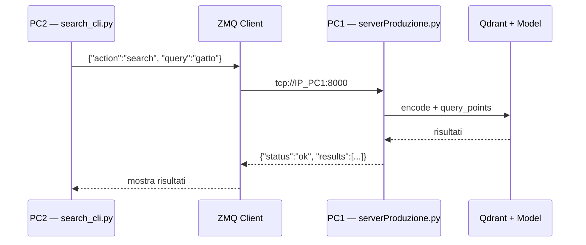

# PC2 — Client Ricerca Semantica (ricevente)

**Data:** 2026-03-05 | Progetto standalone per l'altro PC

> [!NOTE]
> PC2 è il **client** che invia richieste ZMQ a PC1 (server Qdrant) e **riceve** i risultati. Include anche il consumer RabbitMQ per le notifiche (vedi report precedente).

---

## Architettura



---

## Struttura cartella

```
semantic_client/              ← progetto su PC2
├── .env                      Config (IP server, porta)
├── requirements.txt          Dipendenze
├── config.py                 Config loader
├── zmq_client.py             Client ZMQ riutilizzabile
├── search_cli.py             CLI interattiva per ricerca
└── examples.py               Esempi di tutte le azioni
```

---

## `.env`

```ini
# semantic_client/.env
# ⚠️ SERVER_HOST = IP di PC1 dove gira serverProduzione.py

SERVER_HOST=192.168.1.50
SERVER_PORT=8000
USER_ID=1
```

---

## `requirements.txt`

```
pyzmq>=25.0.0
python-dotenv>=1.0.0
```

---

## `config.py`

```python
# semantic_client/config.py

import os

try:
    from dotenv import load_dotenv
    load_dotenv()
except ImportError:
    pass

SERVER_HOST = os.environ.get("SERVER_HOST", "localhost")
SERVER_PORT = int(os.environ.get("SERVER_PORT", "8000"))
USER_ID     = int(os.environ.get("USER_ID", "1"))
SERVER_URL  = f"tcp://{SERVER_HOST}:{SERVER_PORT}"
```

---

## `zmq_client.py` — Client riutilizzabile

```python
# semantic_client/zmq_client.py

import zmq
import json
from config import SERVER_URL


class SemanticClient:
    """
    Client ZMQ per comunicare con il server Qdrant su PC1.
    Pattern REQ/REP — una richiesta, una risposta.
    """

    def __init__(self, server_url: str = None, timeout_ms: int = 10000):
        """
        Args:
            server_url: URL del server (default da .env)
            timeout_ms: timeout in millisecondi (default 10s)
        """
        self.server_url = server_url or SERVER_URL
        self.timeout_ms = timeout_ms
        self._context = None
        self._socket = None

    def _connect(self):
        """Crea connessione ZMQ se non esiste."""
        if self._socket is None:
            self._context = zmq.Context()
            self._socket = self._context.socket(zmq.REQ)
            self._socket.setsockopt(zmq.RCVTIMEO, self.timeout_ms)
            self._socket.setsockopt(zmq.SNDTIMEO, self.timeout_ms)
            self._socket.setsockopt(zmq.LINGER, 0)
            self._socket.connect(self.server_url)

    def _send(self, message: dict) -> dict:
        """Invia richiesta e attende risposta."""
        self._connect()
        try:
            self._socket.send_json(message)
            return self._socket.recv_json()
        except zmq.Again:
            # Timeout — resetta la socket per evitare stato bloccato
            self.close()
            return {"status": "error", "message": f"Timeout ({self.timeout_ms}ms) — server non raggiungibile"}
        except zmq.ZMQError as e:
            self.close()
            return {"status": "error", "message": f"Errore ZMQ: {e}"}

    # --- AZIONI ---

    def create_collection(self, semantica: bool = True) -> dict:
        """Crea/ricrea la collection su Qdrant."""
        return self._send({
            "action": "create_collection",
            "semantica": semantica
        })

    def upsert(self, point_id: int, content: str, user_id: int = None, vector: list = None) -> dict:
        """Inserisce o aggiorna un documento."""
        msg = {
            "action": "upsert",
            "id": point_id,
            "content": content,
            "user_id": user_id or self._default_user_id()
        }
        if vector:
            msg["vector"] = vector
        return self._send(msg)

    def search(self, query: str, limit: int = 3, offset: int = 0, user_id: int = None) -> dict:
        """
        Ricerca semantica per testo.
        Il server vettorizza la query e cerca i documenti più simili.
        """
        return self._send({
            "action": "search",
            "query": query,
            "limit": limit,
            "offset": offset,
            "user_id": user_id or self._default_user_id()
        })

    def search_by_vector(self, vector: list, limit: int = 3, user_id: int = None) -> dict:
        """Ricerca per vettore pre-calcolato."""
        return self._send({
            "action": "search",
            "vector": vector,
            "limit": limit,
            "user_id": user_id or self._default_user_id()
        })

    def get(self, point_id: int) -> dict:
        """Recupera un documento per ID."""
        return self._send({
            "action": "get",
            "id": point_id
        })

    def delete(self, point_id: int, user_id: int = None) -> dict:
        """Elimina un documento."""
        return self._send({
            "action": "delete",
            "id": point_id,
            "user_id": user_id or self._default_user_id()
        })

    def _default_user_id(self) -> int:
        from config import USER_ID
        return USER_ID

    def close(self):
        """Chiude la connessione."""
        if self._socket:
            self._socket.close()
            self._socket = None
        if self._context:
            self._context.term()
            self._context = None

    def __enter__(self):
        return self

    def __exit__(self, *args):
        self.close()
```

---

## `search_cli.py` — CLI interattiva

```python
# semantic_client/search_cli.py

"""
CLI interattiva per ricerca semantica.
Uso: python search_cli.py
"""

from zmq_client import SemanticClient


def print_results(response: dict):
    """Stampa i risultati in modo leggibile."""
    if response.get("status") != "ok":
        print(f"\n  ❌ Errore: {response.get('message', 'sconosciuto')}")
        return

    results = response.get("results", [])
    count = response.get("count", len(results))
    query = response.get("query", "?")

    print(f"\n  🔍 Query: \"{query}\"")
    print(f"  📊 Trovati: {count} risultati\n")

    if not results:
        print("  Nessun risultato trovato.")
        return

    for i, r in enumerate(results, 1):
        score = r.get("score", 0)
        payload = r.get("payload", {})
        content = payload.get("content", "(vuoto)")
        uid = payload.get("user_id", "?")

        # Barra visuale del punteggio
        bar_len = int(score * 20)
        bar = "█" * bar_len + "░" * (20 - bar_len)

        print(f"  {i}. [ID: {r['id']}] score: {score:.4f} |{bar}|")
        print(f"     user_id: {uid}")
        print(f"     contenuto: {content}")
        print()


def main():
    print("=" * 50)
    print("  🔎 Ricerca Semantica — Client PC2")
    print("=" * 50)

    client = SemanticClient()

    print(f"\n  Connesso a: {client.server_url}")
    print("  Comandi: digita una query, oppure:")
    print("    :limit N   — cambia numero risultati")
    print("    :quit      — esci\n")

    limit = 3

    try:
        while True:
            query = input("  query> ").strip()

            if not query:
                continue

            if query == ":quit":
                break

            if query.startswith(":limit"):
                try:
                    limit = int(query.split()[1])
                    print(f"  ✅ Limit impostato a {limit}")
                except (IndexError, ValueError):
                    print("  ⚠️ Uso: :limit N")
                continue

            response = client.search(query=query, limit=limit)
            print_results(response)

    except KeyboardInterrupt:
        print("\n\n  👋 Uscita.")
    finally:
        client.close()


if __name__ == "__main__":
    main()
```

---

## `examples.py` — Esempi completi

```python
# semantic_client/examples.py

"""
Esempi di tutte le azioni disponibili.
Uso: python examples.py
"""

from zmq_client import SemanticClient


def main():
    # Usa context manager per chiusura automatica
    with SemanticClient() as client:

        print("=== 1. Crea collection (semantica) ===")
        r = client.create_collection(semantica=True)
        print(r)

        print("\n=== 2. Inserisci documenti ===")
        docs = [
            (1, "Il gatto dorme sul divano"),
            (2, "Il cane gioca nel giardino"),
            (3, "La macchina è parcheggiata fuori"),
            (4, "Il felino riposa sulla poltrona"),
            (5, "L'automobile è nel garage"),
        ]

        for pid, content in docs:
            r = client.upsert(point_id=pid, content=content)
            print(f"  [{pid}] {r.get('message', r)}")

        print("\n=== 3. Ricerca semantica ===")
        r = client.search(query="animale che riposa", limit=3)
        for res in r.get("results", []):
            print(f"  score={res['score']:.4f} | {res['payload']['content']}")
        # Atteso: "gatto dorme" e "felino riposa" con score alti

        print("\n=== 4. Ricerca non correlata ===")
        r = client.search(query="programmazione Python", limit=3)
        for res in r.get("results", []):
            print(f"  score={res['score']:.4f} | {res['payload']['content']}")
        # Atteso: score bassi per tutti

        print("\n=== 5. Recupera per ID ===")
        r = client.get(point_id=1)
        print(f"  {r}")

        print("\n=== 6. Elimina documento ===")
        r = client.delete(point_id=5)
        print(f"  {r}")

        print("\n=== 7. Verifica eliminazione ===")
        r = client.get(point_id=5)
        print(f"  {r}")


if __name__ == "__main__":
    main()
```

---

## Come avviare su PC2

```bash
# 1. Installa dipendenze
pip install -r requirements.txt

# 2. Configura .env con l'IP di PC1
#    SERVER_HOST=192.168.1.50  (IP dove gira serverProduzione.py)

# 3. CLI interattiva
python search_cli.py

# 4. Oppure: script esempi
python examples.py

# 5. Oppure: uso da codice
python -c "
from zmq_client import SemanticClient
c = SemanticClient()
print(c.search('gatto che dorme'))
c.close()
"
```

---

## Collegamento con il consumer RabbitMQ

> [!TIP]
> Se su PC2 hai anche il **consumer** (dal report precedente), puoi combinare i due progetti nella stessa cartella. In questo modo, mentre fai ricerche via ZMQ, ricevi anche le **notifiche** RabbitMQ in tempo reale:

```
pc2_project/
├── .env                        Config condivisa (IP broker + IP server)
├── requirements.txt            pyzmq + pika + python-dotenv
│
├── # --- Client ZMQ (ricerca) ---
├── config.py
├── zmq_client.py
├── search_cli.py
├── examples.py
│
├── # --- Consumer RabbitMQ (notifiche) ---
├── rabbit_config.py
├── rabbit_logger.py
├── rabbit_connection.py
├── rabbit_topology.py
├── rabbit_consumer.py
└── notification_handler.py
```

```bash
# Terminale 1: consumer notifiche
python rabbit_consumer.py

# Terminale 2: ricerca semantica
python search_cli.py
```
